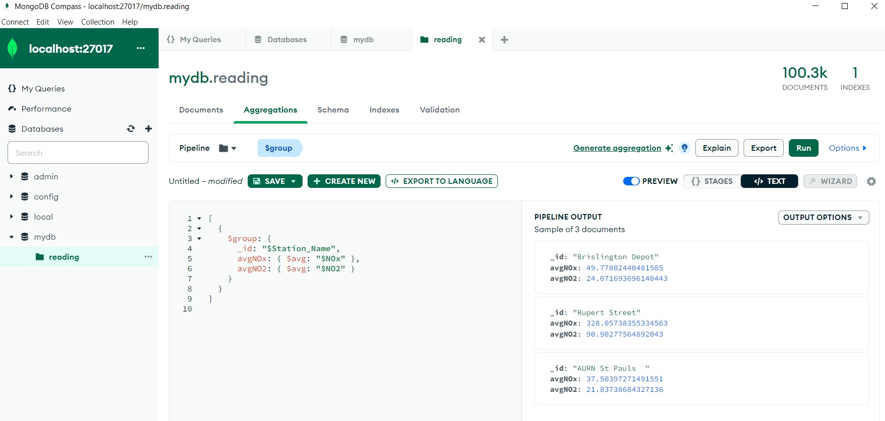
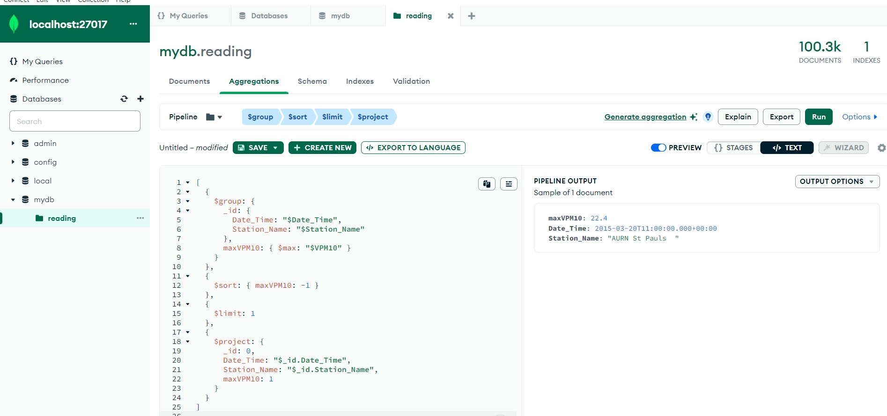

MongoDB as a Database Solution for Data Science Applications:
In selecting MongoDB as my database, I have opted for a leading NoSQL solution specifically designed for data science applications. Its flexibility in managing vast volumes of unstructured data positions it as a preferred choice for storing and analyzing diverse datasets. MongoDB's distinctive features, including its document-oriented model, capabilities for sharing, and support for temporary queries, contribute to its widespread acceptance in the data science community. As the volume of unstructured data requiring efficient storage and analysis increases, MongoDB stands out as one of the most popular tools for exploring and dissecting data.

The advantages of MongoDB in scalability, flexibility, and developer-friendly features transform it into a preferred database solution, enabling data scientists to effectively tackle complex analytical challenges. MongoDB's horizontal scaling features, such as sharding and copying sets, facilitate the distribution of data across multiple servers. This not only enhances the storage capacity of data but also streamlines the efficient processing of large and high-speed datasets. Furthermore, MongoDB seamlessly integrates with leading data science tools and programming environments like Python, R, and Jupyter. This comprehensive integration simplifies the workflow of data analysis, empowering data scientists to easily perform in-depth analysis and manipulation of data.

MongoDB Compass

MongoDB Compass, a graphical interface for MongoDB, provides various benefits that enhance the user experience and streamline database management. It offers an intuitive visualization, simplifying the exploration and understanding of MongoDB data structures. The tool facilitates simplified querying through a user-friendly query bar, boosting productivity in data retrieval and analysis. With support for the Aggregation Pipeline, users can perform advanced data transformations, particularly advantageous for complex data processing tasks. Additionally, MongoDB Compass aids in optimizing query performance by providing insights into existing indexes, allowing users to create indexes based on query patterns for improved database efficiency. Real-time performance metrics enable continuous monitoring, essential for identifying bottlenecks and optimizing system resources. Furthermore, for users accustomed to MongoDB Shell, Compass seamlessly integrates an embedded shell, facilitating a smooth transition between graphical and command-line interfaces.

Denormalization Process

I consolidated the CSV data files for reading, constituency, and station, then imported the merged file into a collection within my MongoDB database. This procedure aligns with denormalization practices commonly observed in SQL databases. In a normalized SQL schema, data is structured to minimize redundancy and dependency. However, denormalization entails intentionally introducing redundancy to improve query performance and streamline data retrieval. Denormalization is particularly beneficial when dealing with read-heavy workloads or situations where complex joins and queries impact performance. By merging tables, you've likely aimed to streamline data access. Subsequently, importing denormalized data into MongoDB as a collection aligns with the nature of NoSQL databases. MongoDB, being schema-less, accommodates flexible data structures like denormalized collections. In the NoSQL realm, the emphasis is on scalability, flexibility, and efficient retrieval rather than rigid adherence to predefined schemas.

Importing Data and Creating Database

I initiated the process by establishing a database and populating it with a collection of 10,300 records. I established a MongoDB database titled "mydb" and integrated a collection named "reading" within it. This database creation and collection inclusion process in MongoDB are foundational steps for organizing and managing data efficiently. The creation of the "mydb" database provides a structured environment for storing related information, while the "reading" collection serves as a container for specific data entities or documents. MongoDB's flexible schema allows for dynamic data storage within collections, contributing to a scalable and adaptable database design. This foundational structure lays the groundwork for further data manipulation, retrieval, and analysis within the MongoDB environment, aligning with best practices in database management and organization.

MongoDB Query Analysis Experience

Executing two queries resembling previous efforts, I incorporated their outcomes into my analysis.
For the first query, I calculated the average values of NOx and NO2. The outcome revealed three stations: Brislington Depot, Rupert Street, and AURN St Pauls. These stations became the focus of the analysis. These stations, due to their elevated concentrations of NOx and NO2 near busy roads, became the focal points of the analysis. This demonstrates MongoDB's capability to handle complex data analyses, aggregating and processing large datasets efficiently for meaningful insights.

For the second query, I sought the highest recorded value of VPM10. The analysis identified the AURN station St Pauls, specifically reporting at 11 am on 20 March 2015, as the location with the highest recorded VPM10. This detailed approach to MongoDB query analysis provides valuable insights into air quality metrics, focusing on specific stations and pollutants.

MongoDB Query Analysis Challenges

Throughout my MongoDB query analysis, several challenges emerged. One significant obstacle was related to MongoDB's querying capabilities. While MongoDB is proficient in handling complex data analyses, certain limitations surfaced when dealing with extensive datasets and intricate queries. Specifically, MongoDB's query language presented challenges in optimizing and executing queries efficiently, especially when extracting nuanced information from large datasets. Another notable challenge involved data consistency and accuracy. Ensuring the reliability and precision of the collected air quality metrics proved to be a meticulous task. MongoDB's data handling, although robust, required careful consideration to avoid discrepancies and inaccuracies in the analysis results.

To overcome challenges with MongoDB in analytics, a systematic approach was taken, implementing targeted solutions for scaling, data modeling, and ensuring data consistency. Additionally, consulting MongoDB's comprehensive guide on data modeling helped in understanding examples, advantages, and considerations, aiding in crafting effective data models. Addressing challenges related to multi-document ACID compliance and data duplication involved recognizing MongoDB's unique architecture and leveraging its scalability, offering a robust solution for ensuring data consistency. These solutions reflect a strategic and well-informed approach, integrating MongoDB Atlas, adherence to best practices, and utilizing available resources and guides, ultimately leading to the successful resolution of challenges and ensuring an efficient analytical workflow.

In conclusion, the experiences with MongoDB showcase its adaptability, scalability, developer-friendly features, and effective tools for query performance analysis. These aspects collectively contribute to MongoDB's widespread adoption in diverse applications and industries.
