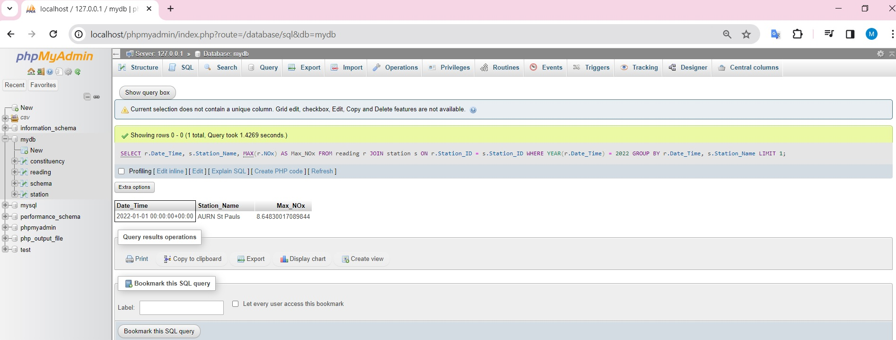
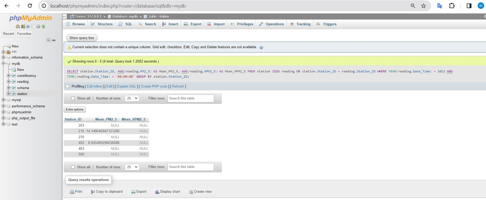
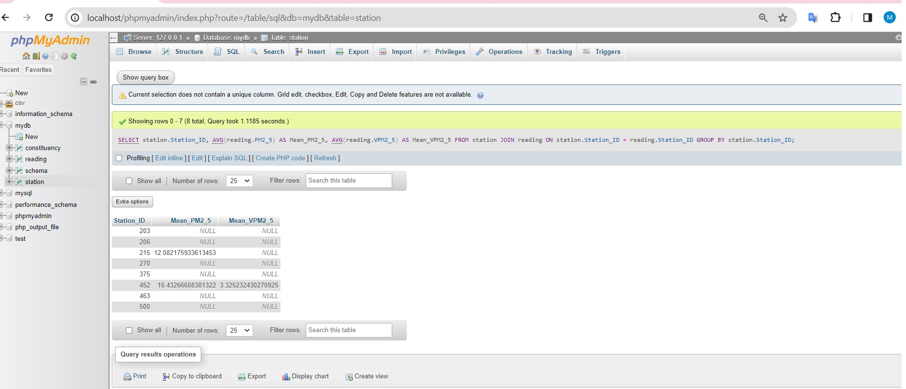

In the beginning phases of crafting my database, I utilized MySQL Workbench for its powerful modeling features, making the process of designing and maintaining the database more straightforward. This tool allowed me to visualize requirements and address design challenges with efficiency. The data modeling aspect in MySQL Workbench involves creating Entity-Relationship (ER) and Notation Three (NTT) models, offering a thorough representation of the database structure. To ensure data consistency, I integrated foreign keys using the EER diagram in MySQL Workbench, ensuring a valid relationship between parent and child tables. These steps, leveraging MySQL Workbench, greatly aided in streamlining the database design and upkeep, adhering to best practices in data modeling and relational integrity. For reference, I included a screenshot labeled "pollution.png" in the report.

In Task 2, I utilized MySQL Workbench to transform my Entity-Relationship (ER) model into a functional MySQL database. The process commenced by configuring MySQL Workbench and loading the pre-existing ER model. Subsequently, I navigated to the "Database" option in the menu and selected "Forward Engineer." 
Upon generating the SQL script, I conducted a thorough review to ensure precision in defining primary and foreign key attributes. Additionally, I verified that the data types assigned to each field were appropriate. This meticulous examination was crucial for maintaining the integrity of key relationships within the database and ensuring compatibility with the designated data types.
Once satisfied with the script's accuracy, I executed the process, resulting in the successful creation of the MySQL database. To preserve this accomplishment, I saved the generated SQL script under the filename "pollution.sql." This file serves as a record of the steps taken in converting the conceptual ER model into a fully functional MySQL database, incorporating essential considerations for key relationships and data types.

Task 3 involved addressing challenges in handling a substantial CSV dataset, primarily due to Excel's limitations. To overcome this, I initially utilized Notepad++ to split the file, managing its unwieldy size effectively. Subsequently, Python played a pivotal role in refining the dataset. For the first task, I successfully filtered and retained data recorded from January 1, 2015, onward. During this process, meticulous attention was given to issues like empty site IDs, negative values, and duplicate entries, ensuring data cleanliness.The refined dataset underwent a thorough cleansing process. I ensured that all dates within this subset fell within a specific timeframe, precisely from January 1, 2015, to October 22, 2023. This systematic and detail-oriented approach was crucial to guarantee the dataset's integrity, making it well-suited for subsequent analyses.

In task 4, I managed dataset integration using PHPMyAdmin and Python. Employing PHPMyAdmin's "import CSV" feature, I seamlessly loaded the dataset into MySQL tables, ensuring smooth integration with the implemented tables from Task 2. Additionally, I leveraged Python, utilizing libraries like "pandas" and "sqlalchemy" for effective data mapping and manipulation. This comprehensive approach showcased the synergy between PHPMyAdmin and Python, highlighting their roles in MySQL administration and versatile data handling.
I successfully accomplished the data mapping task using a Python script named "import.py." This script facilitated the effortless import of the dataset into the MySQL environment, showcasing the adaptability and power of Python in data management tasks. As requested, I provided a screenshot named "readings.png," visually capturing the first 16 records of the main readings file.

SQL Queries and NoSQL Data Modeling Report. Task 5 encompassed a meticulous exploration of air quality data through SQL queries, allowing for precise information retrieval. This task demonstrated the practical application of SQL and NoSQL in environmental data management and analysis.
In Task 5, I was assigned the responsibility of designing, writing, and executing SQL queries on a dataset. The objective was to obtain specific information related to air quality measurements for the year 2022. Additionally, the task required modeling the data for a specific monitoring station to a NoSQL data model, selecting from key-value, XML, or graph models.
i) SQL Query for highest recorded value of NOx:
For the monitoring station AURN St Pauls, I successfully retrieved the Date_Time, Station_Name, and the highest recorded value of nitrogen oxide (NOx) for the year 2022. This initial query provided a detailed snapshot of key air quality metrics for the specified station.

ii) Average Values of PM2_5 and VPM2_5:
In the second query, I computed the average values of PM2_5 and VPM2_5 for each station in 2022, specifically at 8:00 AM and during peak traffic hours. This involved identifying 5 station IDs (203, 215, 270, 452, 463, and 500) and storing the results in a file named sql-b. This step allowed for a focused analysis of air quality during crucial timeframes.

iii) Expanded Query to All Stations:
Expanding on the previous query, the third task broadened the scope to encompass all stations. For the entire set of 2022 readings, I identified 8 station IDs (203, 206, 215, 270, 375, 452, 463, and 500) and stored the corresponding results in a file labeled sql-c. This comprehensive approach provided a holistic overview of air quality metrics across multiple stations.

In Task 6, I opted for MongoDB from the list of eight NoSQL databases. MongoDB stands out for its adaptive data storage and facilitates easy management of diverse data without strict structures. It excels in performance, availability, and scalability, making it suitable for a wide range of applications. The capability for horizontal scaling and sharding enhances its performance in handling large datasets. MongoDB efficiently utilizes considerable memory, particularly with extensive datasets.
To commence the process, I created a database in MongoDB and established a collection of 100,300 records. Subsequently, I executed two queries, akin to the previous task, and included the results of both queries in my analysis.
This selection of MongoDB aligns with its strengths in accommodating flexible data structures, ensuring seamless data management across various applications. The performance boost provided by its horizontal scaling and sharding capabilities further solidifies its suitability for handling substantial datasets effectively.
